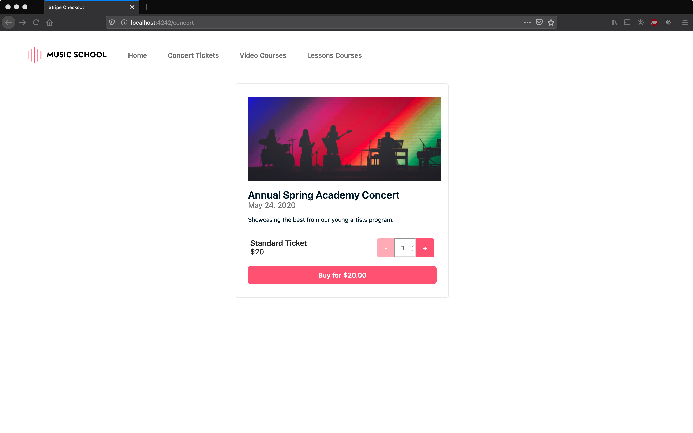

# Card Payments Challenge Section 1: Sell Concert Tickets

## Sections

[Challenge Overview](/README.md)

[Section 1: Sell concert tickets](/README-pt1-concerttickets.md)

[Section 2: Sell video courses](README-pt2-videopurchase.md)

[Section 3: Lesson signup](README-pt3-lessonsignup.md)

[Section 4: Lesson payment capture](README-pt4-paymentcapture.md)

[Section 5: Lesson account management](README-pt5-accountmanagement.md)

[Section 6: Lesson Reporting](README-pt6-reporting.md)

## Getting started

The goal of this section of the challenge is to complete a webpage where customers can purchase tickets to an upcoming concert.

1. Read this document to understand both the section requirements and the repository contents.
2. Complete this section and when you’ve finished push it back to the repo.
3. Move onto another section of the challenge, Video Challenge.

## Section Overview

Every quarter the music store rents out a venue for their students’ recital. They’d like to sell tickets to help cover the costs of putting on the recital.

For the purchase experience, they would like to integrate a simple checkout on their website so that anyone can purchase  their tickets.

The checkout must have the following constraints:

* There is only one type of ticket: General
* Each user can purchase up to 10 tickets
* For this event, the music store will not refund payments

If this business model works, they’ll invest in more features for the next quarter.

* Here is gif showing a successful purchase flow for a customer:

## Requirements

The code we've provided displays the ‘Buy’ button and controls the number of tickets a customer can purchase. Your challenge is to complete the page so that it looks like the gif above.

Your solution should deliver the following:

* When the "Buy" button is clicked, the customer should be redirected to a server side checkout to complete their transaction.

* The session should be created and include the following attributes:
  * ticket price
  * currency
  * the image link specified in the config.json file

* For this challenge, only credit cards will be accepted as payment by the merchant.

* When the customer completes their checkout, please be sure to handle both successful and unsuccessful payments gracefully, with successful payments being directed to ‘/concert-success’.

* As you move through the different stages of the payment intent please ensure your payment intent is up to date by tagging it with the following metadata:
  * {concerttickets:\<quantity>}

## Using the provided starter code

Here's an overview of what's provided in the repo for this section of the challenge:

### For Vanilla Stack

* `/concert.html` → the page shown in the screen shots above.

* `/concert-success.html` → the page shown after a successful payment.

* `/assets/js/checkout.js` → This file contains the current functionality being used on the page.  Feel free to modify this file as you integrate Checkout.
The client directory contains additional CSS, JavaScript and image files in the `assets` directory, we don't expect you to need to modify any of these files.

**Note**: If you would like to replace this with a template from your preferred framework you may do so, but please preserve existing DOM element ids in the page.

### For React

* `src/pages/Concert.js` → component that generate the page shown in the screen shots above.

* `src/pages/ConcertSuccess.js` → component that generate the page shown after a successful payment.

* `src/components` → List of components use to build pages shown above.
  * `Util.js` → Contain functions share among different components.

* `src/Services/concert.js` → API petitions for backend.

**Note**: You may modify, split or add components but please preserve existing DOM element ids in the page.

### Server

* On the server side we've defined a couple routes, you are welcome to modify the code in the routes.

* It is expected that you will add additional routes to the server, the names can be whatever you choose.

Existing Routes

* `/concert` → this displays the concert ticket purchase page and should not be renamed.

* `/setup-concert-page` -> a helper route used by the purchase page to retrieve information needed to display the page.  You don't have to use this if you'd take another approach.

## Running Locally

As a first step in completing the challenge we recommend you get your local server up and running. See the main README info on getting up and running with our server implementations.

With your server running the page for this section should look like this:

## Push Your Challenge

When you are done with this section and checked that your code works locally, push your changes to the branch you are working on. Open a PR per section completed or a single PR to merge the solution for all of the sections.

## Navigation

[Continue to Section 2: Sell video courses](README-pt2-videopurchase.md)
