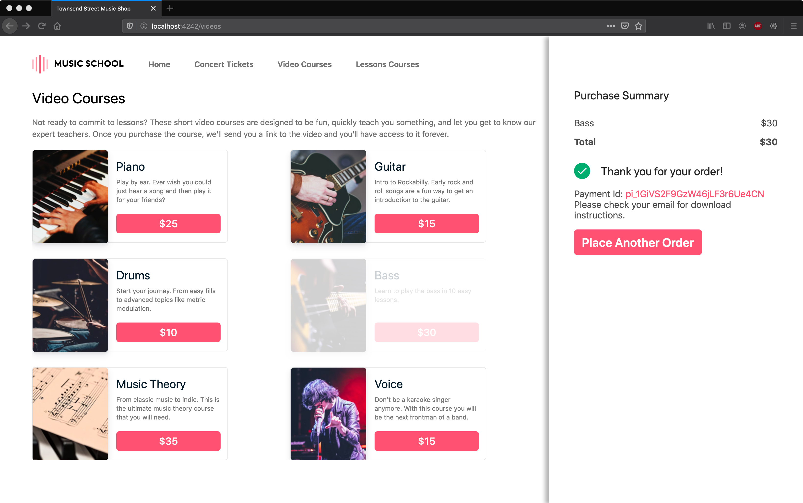
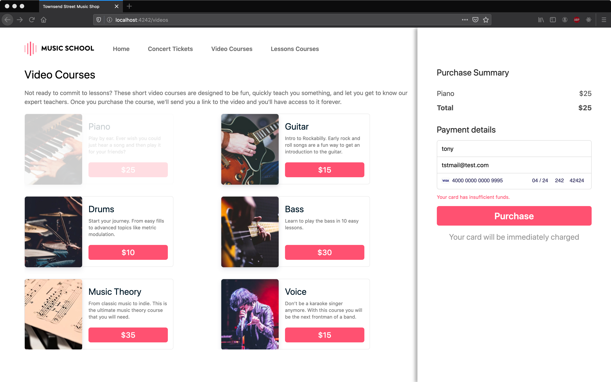
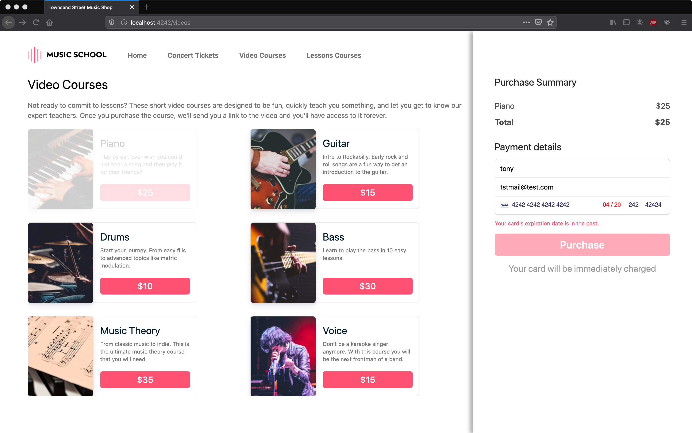
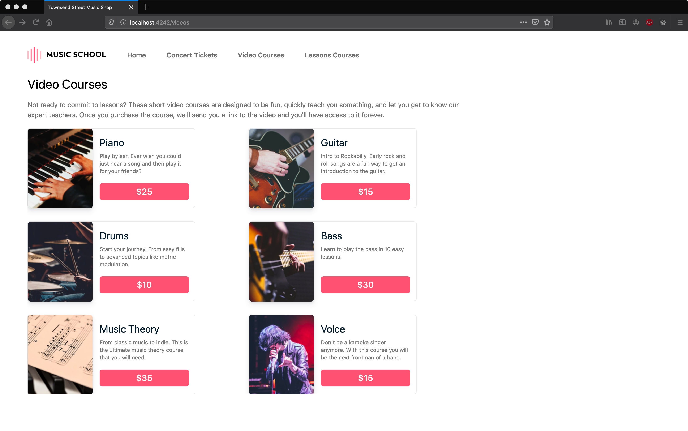

# Card Payments Challenge Section 2: Online Video Purchase

## Sections

[Challenge Overview](/README.md)

[Section 1: Sell concert tickets](/README-pt1-concerttickets.md)

[Section 2: Sell video courses](README-pt2-videopurchase.md)

[Section 3: Lesson signup](README-pt3-lessonsignup.md)

[Section 4: Lesson payment capture](README-pt4-paymentcapture.md)

[Section 5: Lesson account management](README-pt5-accountmanagement.md)

[Section 6: Lesson Reporting](README-pt6-reporting.md)

## Getting started

The goal of this section of the challenge is to build a web page where customers can purchase educational videos.

This section of the challenge comprises the following instructions:

1. Read this document to understand both the section requirements and the repository contents.
2. Complete this section and when you’ve finished push it back to the repo.
3. Move on to the final section of the challenge, Lesson sign-up.

## Section Overview

After the success of the academy concert, many attendees expressed their desire to learn an instrument. However, they don’t always have availability to take classes in person. They've said that it would be great to have access to videos (like some on Youtube) to be able to learn at home. So, looking to grow its business, the head of the music store wants to offer video lessons.

You will build a web page that enables customers to purchase one or more instructional videos.

The web page must meet the following requirements:

* Customers must be able to select one or more videos to purchase.
* Order information must be shown within a Purchase Summary at the right side of the page.
* If two or more videos are purchased in a single order, a 20% discount has to be applied to said order.

Here is gif showing a successful purchase flow for a customer:

## Requirements

The code we've provided displays the available videos and updates the Purchase Summary section of the page as the customer adds a video to their order but doesn't handle collecting the payment for the videos. Complete the requirements listed below to be able to process payments. After completing the challenges your solution should look like the gif.

Please complete the page to support the following requirements:

* Your solution should use Elements and the Payment Intents API.

* The customer should be able to purchase multiple videos in one payment.

* Your solution should use the logic to handle items being added or removed from the cart. Your solution should use 1 PaymentIntent per user order attempt, i.e. if the customer updates their order after you've created a PaymentIntent your solution should update the existing PaymentIntent rather than create another.

* Store the IDs of the videos purchased in the metadata of the Payment Intent, for example:
  * videos: “guitar, ukelele”

* Your code should protect against a user trying to edit the price of an order.

* The currency of the payment should be 'usd'.

* The customer should be shown a payment form w/in the Purchase Summary section in which to enter their credit card information and the postal code.

* The customer name and email address should be collected when capturing the credit card information.

* You **do not** need to save the customer’s payment method for future purchases.

* The payment intent should be confirmed so that Stripe can send a receipt to the email address provided by the customer.

* The payment intent should be confirmed so that the Stripe will include the video ID(or IDs) in the statement descriptor for the charge.

* While the payment is being processed the purchase button should be disabled and the provided spinner should be displayed.

* Any errors when capturing your payment of the credit card information should be managed properly. Check the error management section details.

* After an order is successfully paid the page should thank the customer for their order and display the ID for their payment. The page should look like this:

Your solution should listen for webhook events indicating whether the payment was successful or not.  When you receive a `payment_intent.succeeded` or `payment_intent.payment_failed` event, please update the PaymentIntent metadata with the key "event_recieved" and value of the event type. 

### Error management

Any errors from the customer’s card being declined or from your server should be handled gracefully.  If the error resulted in a user friendly message that should be displayed to the customer and they should be allowed to retry their payment.  

For example, displaying an "insufficient funds" error:

Or a expiration date error:

## Using the provided starter code

Here's an overview of what's provided in the repo for this section of the exam:

### Vanilla Stack

* `/videos.html` → the page shown in the screen shots above.

* `/assets/js/videos.js` → This file contains various functions you should use on the page, please read the comments so you know what’s available to you. Feel free to modify any of these functions as you integrate Elements.

* The client directory contains additional CSS, JavaScript and image files in the `assets` directory, we don't expect you to need to modify any of these files.

**Note**: If you would like to replace this with a template from your preferred framework you may do so, but please preserve existing DOM element ids in the page.

### React Client

* `src/pages/Videos.js` → component that generates the page shown in the screen shots above.

* `src/components` → List of components used to build page shown above.
  * `SREItem.js` → Show list of video courses.
  * `SummaryTable.js` → Show purchase summary.
  * `PaymentForm.js` → Show form for user information.
  * `Util.js` → Contain functions shared among different components.
* `src/Services/video.js` → API petitions for backend.

**Note**: You may modify, split or add components but please preserve existing DOM element ids in the page.

### Server

* On the server side we've defined a couple routes, you are welcome to modify the code in the routes.

* It is expected that you will add additional routes to the server, the names can be whatever you choose.

Existing routes:

* `/videos` → this displays the purchase page and should not be renamed.

* `/setup-video-page` -> a helper route used by the purchase page to return information needed to display the page.  You don't have to use this if you'd rather do something else.

## Running Locally

As a first step in completing the challenge we recommend you get your local server up and running. See the main README info on getting up and running with our server implementations.

With your server running the page for this section should look like this:

## Push Your Challenge

When you are done with this section and checked that your code works locally, push your changes to the branch you are working on. You can open a PR per section completed or a single PR to merge the solution for all of the sections.

## Navigation

[Continue to Section 3: Online Lessons](README-pt3-lessonsignup.md)
