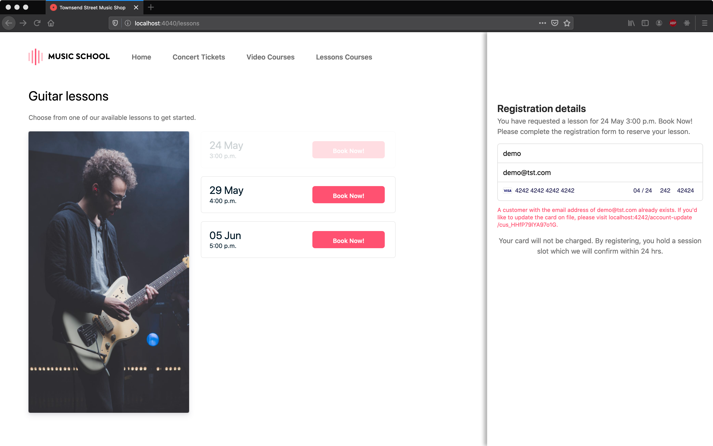
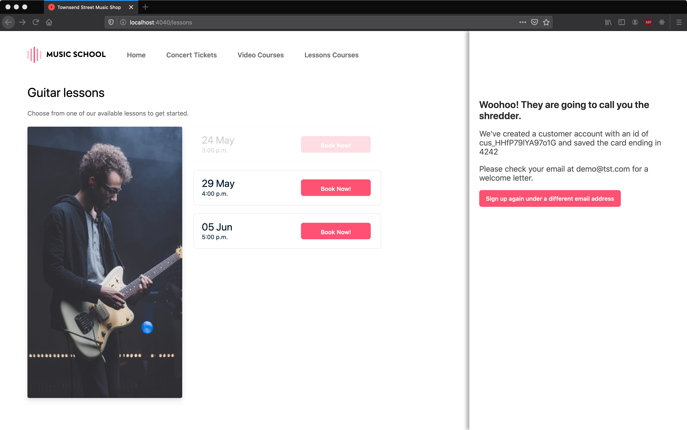
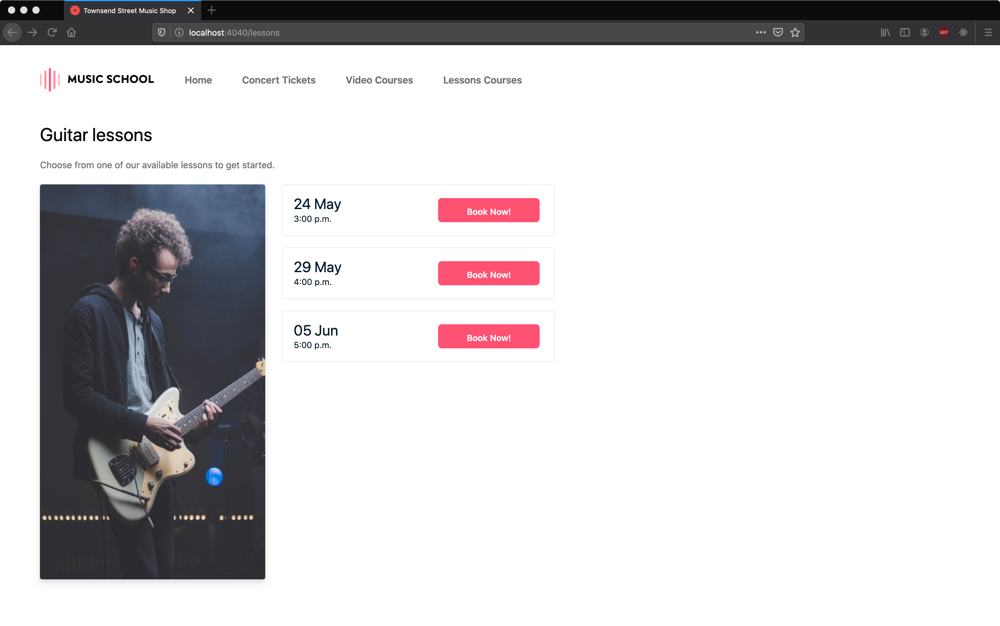

# Card Payments Challenge Section 3: Online Lessons - Sign Up

## Sections

[Challenge Overview](/README.md)

[Section 1: Sell concert tickets](/README-pt1-concerttickets.md)

[Section 2: Sell video courses](README-pt2-videopurchase.md)

[Section 3: Lesson signup](README-pt3-lessonsignup.md)

[Section 4: Lesson payment capture](README-pt4-paymentcapture.md)

[Section 5: Lesson account management](README-pt5-accountmanagement.md)

[Section 6: Lesson Reporting](README-pt6-reporting.md)

## Getting started

To goal of this section of the challenge is to add functionality to the app that allows customers to sign up for online lessons.

## Section Overview

The store has gotten a lot of nice feedback from their instructional videos and recitals and has decided to start offering online guitar lessons.  While music lessons are typically sold as month to month commitments, the store wants to appeal to busy adults, not require them to commit to weekly lessons and instead let students book lessons individually.   The flow they want to support looks like this:

- Students will sign up for lessons by selecting a time for their first lesson and providing their credit card

- Prior to the lesson the store will authorize the students card for the lesson.  This has to happen separate from the sign up because the lesson might be several weeks out.

**Note**: in a real application, you’d likely have a database to manage customer details, historical payment information and your app would require authentication for a lot of this functionality. For the purposes of this challenge we have none of this, and we ask to you to engage in a little suspension of disbelief. You can imagine what you are building would normally be sitting inside a more robust application, or that for functionality that requires you to pull information from the API will eventually migrate to a local database.

## Requirements

For this section you will have to complete the app to create a customer and authorize their payment method for future charges.

#### Lesson signup and card collection

To sign up for lessons the student needs to select an initial lesson time and provide their payment information.

- Complete `lessons.html` or `src/pages/Lessons.js` (react client), and the `/lessons` route to allow the student to pick a time for their first lesson and provide their credit card to sign up for lessons. This page should use Elements and Setup Intents, since the available lesson times are always more than 1 week out.

- The app should ensure there is only 1 Customer object per email address. If a customer tries to sign up again with the same email address, the app should show them the provided error and a link to the account-update.html where they can update their payment information.  

- The app should ensure a customer only ever has 1 payment method stored.

- Set both the customer and the payment's methods billing details to the name and email address they supply.

- Set a metadata field `first_lesson` to the lesson date and time they select.  The store will use this later to determine when to make the first payment.

- After the student has successfully signed up for a lesson, complete message displayed in the `id="signup-status"` div to show the new customer id and the last 4 of their card.

## Using the provided starter code

For this section of the exam there is a UI component for the lesson sign up.

### Vanilla Stack

- `/lessons.html` → the lesson sign up page shown in the screen shots above.

- `/assets/js/lesson-signup.js` → This file contains various functions you should use on the page, feel free to modify any of these functions as you integrate Elements.

**Note**: If you would like to replace this with a template from your preferred framework you may do so, but please preserve existing DOM element ids in the page.

**Note**: The client directory contains additional CSS, JavaScript and image files in the `assets` directory, we don't expect you to need to modify any of these files.

### React Client

- `src/pages/Lessons.js` → component that generate the lesson sign up page shown in the screen shots above.

- `src/components` → List of components use to build page shown above.
  - `RegistrationForm.js` → Show form for user information.

**Note**: You may modify, split or add components but please preserve existing DOM element ids in the page.

### Server

On the server side we've defined all the routes above. Please use those to complete the functionality.  See the server file for more information on parameters each route should accept and the format of the JSON response they should return.

### Running locally

As a first step in completing the challenge we recommend you get your local server up and running.  

See the main README info on getting up and running with our server implementations.

With your server running the page for this section should look like this:

## Submitting your challenge

When you are done with this section and checked that your code works locally, push your changes to the branch you are working on. You can open a PR per section completed or a single PR to merge the solution for all of the sections.

## Navigation
[Continue to Section 4: Lesson payment capture](README-pt4-paymentcapture.md)

