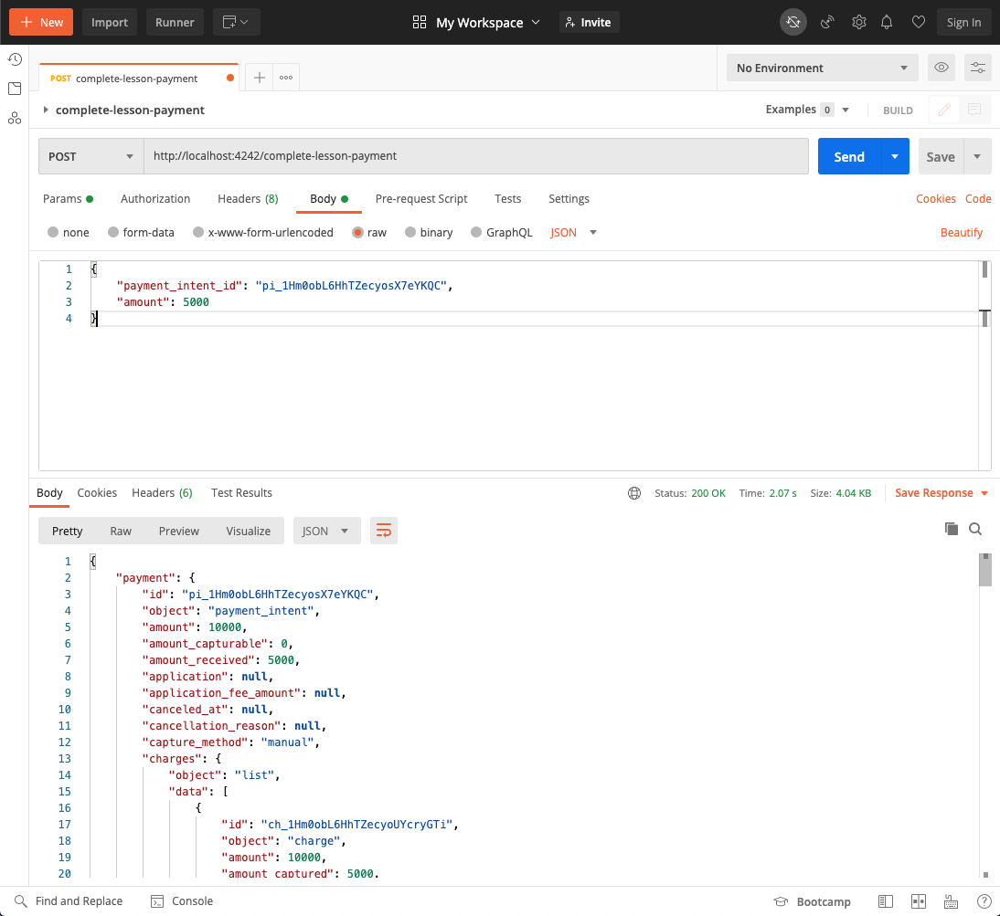

# Card Payments Challenge Section 4: Online Lessons - Payment Capture

## Sections

[Challenge Overview](/README.md)

[Section 1: Sell concert tickets](/README-pt1-concerttickets.md)

[Section 2: Sell video courses](README-pt2-videopurchase.md)

[Section 3: Lesson signup](README-pt3-lessonsignup.md)

[Section 4: Lesson payment capture](README-pt4-paymentcapture.md)

[Section 5: Lesson account management](README-pt5-accountmanagement.md)

[Section 6: Lesson Reporting](README-pt6-reporting.md)

## Getting started

To goal of this section of the challenge is to add functionality to the app that allows the music store to capture payments for online lessons.

## Section Overview

The instructor will capture the payment amount after the lesson.  It’s up to the instructor to decide the total amount of the lesson as long as it’s less than the authorization amount.  For example, if they only met for 45 min but had purchased an hour, the instructor might not charge the student the full amount.

- Future lessons will be coordinated by teacher and student and authorized and then captured like the first lesson.

**Note**: in a real application, you’d likely have a database to manage customer details, historical payment information and your app would require authentication for a lot of this functionality.  For the purposes of this challenge we have none of this, and we ask to you to engage in a little suspension of disbelief. You can imagine what you are building would normally be sitting inside a more robust application, or that for functionality that requires you to pull information from the API will eventually migrate to a local database.

## Requirements

You’ll add functionality so that the store can create and refund payments. This section has no UI, you will only need to  complete the server routes for each section.

#### Schedule a lesson and authorize a payment

Complete the `/schedule-lesson` route to authorize a payment for an upcoming lesson.

- This route takes the following parameters:
  - `customer id`
  - `amount` the price of the lesson in cents
  - `description` of the lesson
- You can assume the currency of the charge is `usd`
- Include `type: 'lessons-payment'` in metadata field to identified these payments in the future.
- Returns either information about the payment intent created or an error.
  - Success:

- Error

#### Complete a lesson payment

Complete the `/complete-lesson-payment` route to capture an authorized charge for a lesson.

- This route takes the following parameters:
  - `payment_intent_id`: the id of the payment intent to capture
  - `amount`: (optional) an optional amount to capture.  This parameter would be supplied if the teacher decided to give a discount on the lesson for some reason.
- Returns information about the payment intent or an error.

- Success

- Error

#### Refund a lesson

Complete the  `/refund-lesson` route so that the music store can refund the student. The store will use this route to refund payments lessons that have already happened and also to cancel an auth if an upcoming lesson is canceled.

- This route takes the following parameters:
  - `payment_intent_id`: the id of the payment intent to refund
  - `amount`: (optional) an optional amount to refund.  This parameter would be supplied if the store decided to give a refund only part of a lesson payment.
- Returns the refund id if successful, or an error.
  - Success:

  - Error:

## Using the provided starter code

For these requirements you only need to complete the specified route within the server.  See the server file for more information on parameters each route should accept and the format of the JSON response they should return.

### Server

On the server side we've defined all the routes above. Please use those to complete the functionality.  See the server file for more information on parameters each route should accept and the format of the JSON response they should return.

### Running locally

As a first step in completing the challenge we recommend you get your local server up and running.  

See the main README info on getting up and running with our server implementations.

## Push Your Challenge

When you are done with this section and checked that your code works locally, push your changes to the branch you are working on. You can open a PR per section completed or a single PR to merge the solution for all of the sections.

## Navigation
[Continue to Section 5: Lesson account management](README-pt5-accountmanagement.md)
