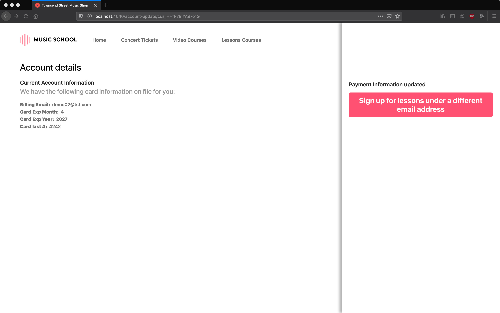

# Card Payments Challenge Section 5: Online Lessons - Account Management

## Sections

[Challenge Overview](/README.md)

[Section 1: Sell concert tickets](/README-pt1-concerttickets.md)

[Section 2: Sell video courses](README-pt2-videopurchase.md)

[Section 3: Lesson signup](README-pt3-lessonsignup.md)

[Section 4: Lesson payment capture](README-pt4-paymentcapture.md)

[Section 5: Lesson account management](README-pt5-accountmanagement.md)

[Section 6: Lesson Reporting](README-pt6-reporting.md)

## Getting started

To goal of this section of the challenge is to add functionality to the app that allows customers to update and/or delete their account.

## Section Overview

After signing up, the user will be able to update their account information as well as their payment method. If they do not have any uncaptured payment, they will be able to delete their account.

**Note**: in a real application, you’d likely have a database to manage customer details, historical payment information and your app would require authentication for a lot of this functionality. For the purposes of this challenge we have none of this, and we ask to you to engage in a little suspension of disbelief. You can imagine what you are building would normally be sitting inside a more robust application, or that for functionality that requires you to pull information from the API will eventually migrate to a local database.

## Requirements

You’ll complete the app to update a stored payment method, and delete the customer when requested.

#### Account update

Students can update their payment information on the account update page.

- Complete `account-update.html` or `src/pages/AccountUpdate.js` (react client), and `/account-update/:customer_id` so that a customer can update the payment method they have on file. This page should also use Setup Intents and Elements.

- Complete the `account-update.html` page so that the details of the students card are displayed when the page is loaded and after the payment method is updated.   See the div `id="account-information"` in the HTML for the specific fields.

- Update the Customer object using the payment method generated by the Setup Intent.  This update should replace the payment method currently associated with the customer.

- Update the name or email address for the Customer object if the customer updates it. Display an error if the a new email address supplied is already associated with another customer.

#### Account delete

Students may decide they want to cancel their account and no longer have their payment method on file. However the music store doesn’t want to automatically close any accounts that have payments authorized but not yet captured. Complete the `/delete-account/:customer_id` route to do the following:

- Given a customer id as a parameter, delete the Customer object in Stripe if there aren’t any uncaptured payments associated with the customer.  Return any errors that occur if the delete call fails.

- If the customer does have uncaptured payments return information about those uncaptured payments in the response so the music store administrator can see them.

- Note there is no UI for this functionality, you only need to complete the server route.

## Using the provided starter code

For this section of the exam there is a UI component to manage updating the account's information. For the rest of the requirements you only need to complete the specified route within the server.  See the server file for more information on parameters each route should accept and the format of the JSON response they should return.

### Vanilla Stack

- `/account-update.html`  → the account sign up page shown in the screen shots above.

- `/assets/js/account-update.js` → This file contains various functions you should use on the page, feel free to modify any of these functions as you integrate Elements.

**Note**: If you would like to replace this with a template from your preferred framework you may do so, but please preserve existing DOM element ids in the page.

**Note**: The client directory contains additional CSS, JavaScript and image files in the `assets` directory, we don't expect you to need to modify any of these files.

### React Client

- `src/pages/AccountUpdate.js` → component that generate the account sign up page shown in the screen shots above.

- `src/components` → List of components use to build page shown above.
  - `RegistrationForm.js` → Show form for user information.

- `src/Services/account.js` → API petitions for backend (AccountUpdate endpoints).

**Note**: You may modify, split or add components but please preserve existing DOM element ids in the page.

### Server

On the server side we've defined all the routes above. Please use those to complete the functionality.  See the server file for more information on parameters each route should accept and the format of the JSON response they should return.

### Running locally

As a first step in completing the challenge we recommend you get your local server up and running.  

See the main README info on getting up and running with our server implementations.

With your server running the page for this section should look like this:

## Submitting your challenge

When you are done with this section and checked that your code works locally, push your changes to the branch you are working on. You can open a PR per section completed or a single PR to merge the solution for all of the sections.

## Navigation
[Continue to Section 6: Lesson Reporting](README-pt6-reporting.md)