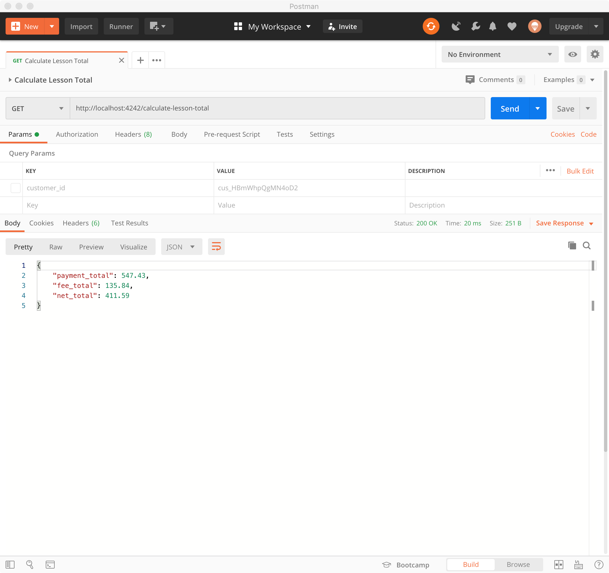
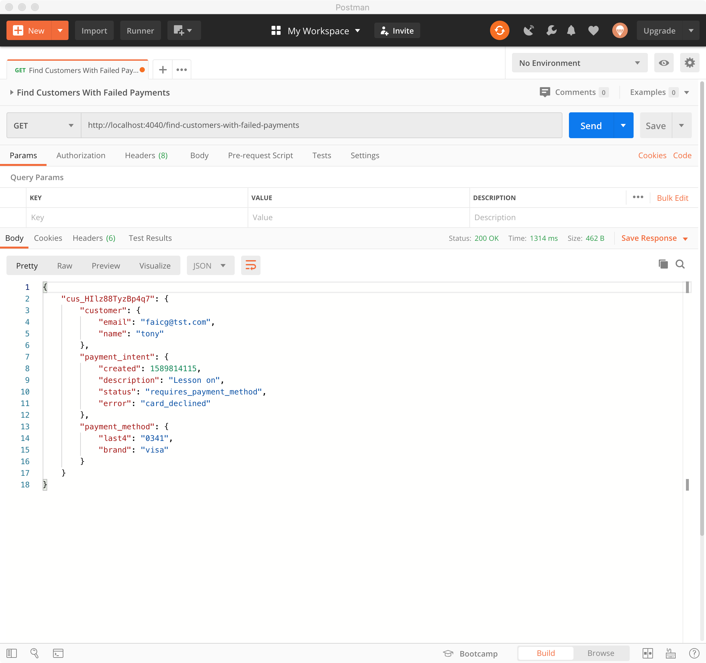

# Card Payments Challenge Section 6: Online Lessons - Reporting

## Sections

[Challenge Overview](/README.md)

[Section 1: Sell concert tickets](/README-pt1-concerttickets.md)

[Section 2: Sell video courses](README-pt2-videopurchase.md)

[Section 3: Lesson signup](README-pt3-lessonsignup.md)

[Section 4: Lesson payment capture](README-pt4-paymentcapture.md)

[Section 5: Lesson account management](README-pt5-accountmanagement.md)

[Section 6: Lesson Reporting](README-pt6-reporting.md)

## Getting started

To goal of this section of the challenge is to add functionality to the app that allows the music store to retrieve data on their revenues and customers.

## Section Overview

In this section you’ll calculate the total amount that the school has earned on guitar lessons so they can pay the teacher. You'll also determine which students need to update their payment methods. This section has no UI, you will only need to complete the server routes for each section.  

**Note**: in a real application, you’d likely have a database to manage customer details, historical payment information and your app would require authentication for a lot of this functionality. For the purposes of this challenge we have none of this, and we ask to you to engage in a little suspension of disbelief. You can imagine what you are building would normally be sitting inside a more robust application, or that for functionality that requires you to pull information from the API will eventually migrate to a local database.

## Requirements

Gather information about the store's lesson business.  In this section you’ll calculate the total amount that the school has earned on guitar lessons so they can pay the teacher. You'll also determine what student need to update their payment methods.

#### Total earned from lessons

The music store needs to calculate how much they have earned on lessons from last week (7 days before) so that they can pay their teacher. Complete the `/calculate-lesson-total` route to return the total amount of money the store has netted from lessons, minus any Stripe fees or refunds (including refunds due to disputes).

- For now this route doesn’t take any parameters.
- Returns information about the total and net amounts earned, plus total amount paid in fees.
- Return only information from 7 days before an until the day the information is requested. e.g. if the information is requested on May 18, the records to review were created on May 11 and after.

#### Find customers with bad payment methods

Every week the music store would like to send out an email asking customers to update their payment information if necessary.  Complete the `/find-customers-with-failed-payments` route to return a list of customers who meet the following two requirements:

- The last payment associated with them did not succeed.
- Only consider payments failed in the last week (7 days before).
- The payment method on file for them matches the payment method used for the failed payment attempt.  In other words, the customer has not yet updated their payment method and the store can expect future payments to fail.

- For now this route doesn’t take any parameters.
- For each customer identified returns information about the customer, their stored payment method and the failed payment.

## Using the provided starter code

For this section of the exam there is no UI component. You only need to complete the specified route within the server.  See the server file for more information on parameters each route should accept and the format of the JSON response they should return.

### Server

On the server side we've defined all the routes above. Please use those to complete the functionality.  See the server file for more information on parameters each route should accept and the format of the JSON response they should return.

### Running locally

As a first step in completing the challenge we recommend you get your local server up and running.  

See the main README info on getting up and running with our server implementations.

## Push Your Challenge

When you are done with this section and checked that your code works locally, push your changes to the branch you are working on. You can open a PR per section completed or a single PR to merge the solution for all of the sections.
